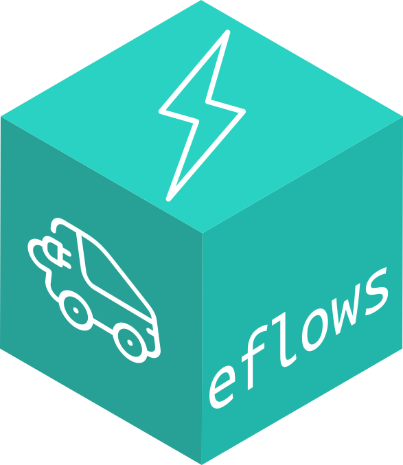

<!-- README.md is generated from README.Rmd. Please edit that file -->
vtools 
=============================================================

[](https://travis-ci.org/cvmartin/vtools)

Overview
--------

ggplot2 is a system for declaratively creating graphics, based on [The Grammar of Graphics](http://amzn.to/2ef1eWp). You provide the data, tell ggplot2 how to map variables to aesthetics, what graphical primitives to use, and it takes care of the details.

Installation
------------

``` r
# The easiest way to get ggplot2 is to install the whole tidyverse:
install.packages("tidyverse")

# Alternatively, install just ggplot2:
install.packages("ggplot2")

# Or the the development version from GitHub:
# install.packages("devtools")
devtools::install_github("tidyverse/ggplot2")
```
